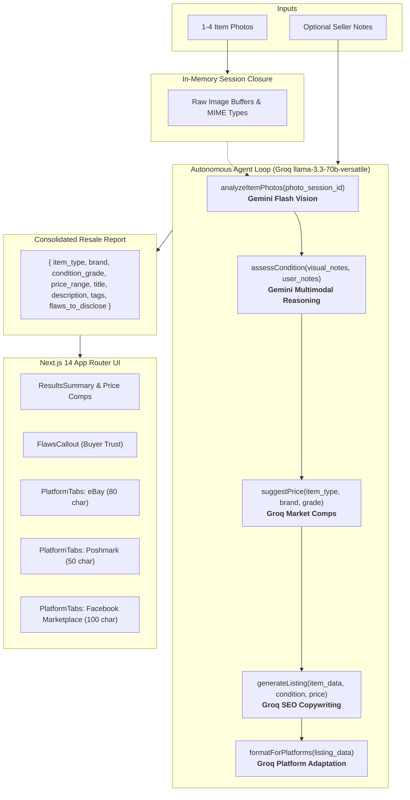

# Resale Listing Agent

> An autonomous hybrid AI pipeline that turns 1–4 raw item photos and optional seller notes into condition appraisals, market pricing comps, and platform-optimized listings for **eBay**, **Poshmark**, and **Facebook Marketplace**.

---

## Demo


---

## Why This Architecture?

### 1. Hybrid Model Strategy (Gemini Vision + Groq Text Reasoning)
Rather than relying on a single monolithic model for all steps, this pipeline divides tasks by optimal modality and economics:
- **Google Gemini (`gemini-flash-latest`)** handles visual inspection. Gemini natively ingests multi-image inputs (1–4 photos per request) with a 1M token context window, allowing front, back, tag, and detail shots to be evaluated simultaneously with zero downsampling.
- **Groq (`llama-3.3-70b-versatile`)** orchestrates the agent loop and handles text reasoning (market comps valuation, SEO copywriting, and platform formatting). Groq provides sub-second inference speeds and generous throughput for purely textual reasoning steps where vision capabilities are unnecessary.

*Framing*: This hybrid approach is a deliberate cost-and-latency optimization, maximizing multimodal visual fidelity while keeping text reasoning fast and cost-effective.

### 2. Enforced Structured Outputs (No Brittle Text Parsing)
Every stage of the pipeline enforces valid, typed JSON schemas:
- **Gemini Vision**: Utilizes Gemini's native `responseSchema` and `responseMimeType: "application/json"`.
- **Groq Reasoning**: Utilizes OpenAI-compatible `response_format: { type: "json_object" }` alongside explicit system schema instructions.

This eliminates regex parsing failures and guarantees deterministic payloads between pipeline tools and frontend interfaces.

### 3. Agentic Function-Calling with In-Memory Image Closure
Rather than a rigid linear pipeline, the system uses an OpenAI-compatible function-calling loop orchestrated by Groq (`llama-3.3-70b-versatile`). The orchestrator dynamically evaluates the item's context and decides which tools to execute and in what order.

**Handling Image Data in a Text-Only Function Loop**:
Text-based LLMs cannot accept raw binary image buffers as JSON function-call arguments without blowing past context budgets or encountering encoding serialization bottlenecks. 
- *Architecture Decision*: The agent orchestrator passes lightweight session tokens (`photo_session_id`).
- *Execution Layer*: The underlying JavaScript tool handler directly accesses raw image `Buffer` instances held in an in-memory session closure, preventing multi-megabyte base64 payloads from round-tripping through the LLM.

### 4. Decoupled Platform Adaptation Layer
Core item analysis (`item_type`, `brand`, `condition_grade`, `flaws_to_disclose`, `price_range`) is strictly decoupled from platform-specific copy generation.
- **Separation of Concerns**: eBay requires 80-character keyword-frontloaded titles and structured specs; Poshmark favors 50-character casual titles with bundle discount callouts; Facebook Marketplace requires local pickup/cash terms with no hashtags.
- Platform conventions and character limits change frequently. Decoupling the platform layer allows marketplace formats to evolve without invalidating the foundational item appraisal.

---

## Architecture Flow



---

## Tech Stack

- **Frontend**: Next.js 14 (App Router), React 18, Tailwind CSS, Lucide Icons
- **Typography**: Space Grotesk (Headings) & Inter (UI/Body) via `next/font/google`
- **Vision Engine**: Google Gemini API (`@google/generative-ai`, `gemini-flash-latest`)
- **Reasoning & Tool Orchestration**: Groq SDK (`groq-sdk`, `llama-3.3-70b-versatile`)
- **Language & Runtime**: Node.js (ES Modules), TypeScript

---

## Local Setup & Installation

### 1. Clone & Install Dependencies
```bash
git clone https://github.com/your-username/resale-listing-agent.git
cd resale-listing-agent
npm install
```

### 2. Configure Environment Variables
Create a `.env` file in the project root based on `.env.example`:
```bash
cp .env.example .env
```
Populate your API keys:
```env
GEMINI_API_KEY=your_google_gemini_api_key_here
GROQ_API_KEY=your_groq_api_key_here
```
> **Get Free API Keys**:
> - Gemini API Key: [Google AI Studio](https://aistudio.google.com/)
> - Groq API Key: [Groq Console](https://console.groq.com/)

### 3. Run the Next.js Frontend
```bash
npm run dev
```
Open [http://localhost:3000](http://localhost:3000) in your browser.

### 4. Run the Standalone CLI Agent Pipeline
```bash
# Standard run with human-readable tool trace
npm run pipeline

# Verbose debug run with raw LLM turn-by-turn request/response
node pipeline.js --verbose
```

---

## Production Roadmap & Engineering Considerations

If scaling this system into a multi-tenant public production product, the following additions would be prioritized:

1. **API Rate Limiting & Quota Throttling**: Implement token-bucket rate limiting per user/IP and tier-based caching for brand catalog lookups to prevent quota exhaustion.
2. **Persistent Listing History**: Add PostgreSQL / Supabase storage with image CDN hosting (e.g., Cloudflare R2 / AWS S3) for long-term inventory archiving and CSV export.
3. **Image Quality & Pre-Flight Validation**: Add client-side blur detection and resolution checks before upload, prompting users to retake photos if label text or hardware is illegible.
4. **Automated Content Moderation**: Integrate safety filters to detect prohibited items (e.g., counterfeit goods, weapons, inappropriate imagery) before passing images to downstream models.
5. **Human-in-the-Loop Review Step**: Maintain a review step where sellers can edit titles, prices, or descriptions before triggering any direct marketplace API posting (e.g., eBay Trading API or Mercari API).

---

## License

This project is licensed under the [MIT License](./LICENSE).
